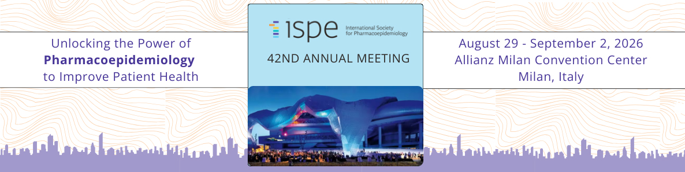

**Unlocking the Power of Pharmacoepidemiology to Improve Patient Health**
>Allianz Milan Convention Center, Milan, Italy
>August 29-September 2, 2026 

## About

# Agentic Code Review and Validation

This repository provides an introduction to agentic coding assistants, with a focus on GitHub Copilot and its applications in code development, review, and validation. It includes educational materials, example prompts, and practical demonstrations tailored for pharmacoepidemiology and drug safety research. The content covers Copilot's features, use cases for analytic code and git workflows, prompt engineering strategies, and model comparisons, aiming to enhance transparency, reproducibility, and efficiency in research coding practices.

