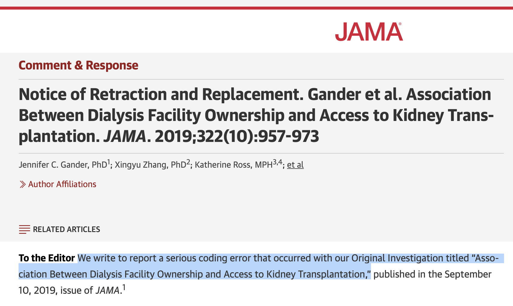
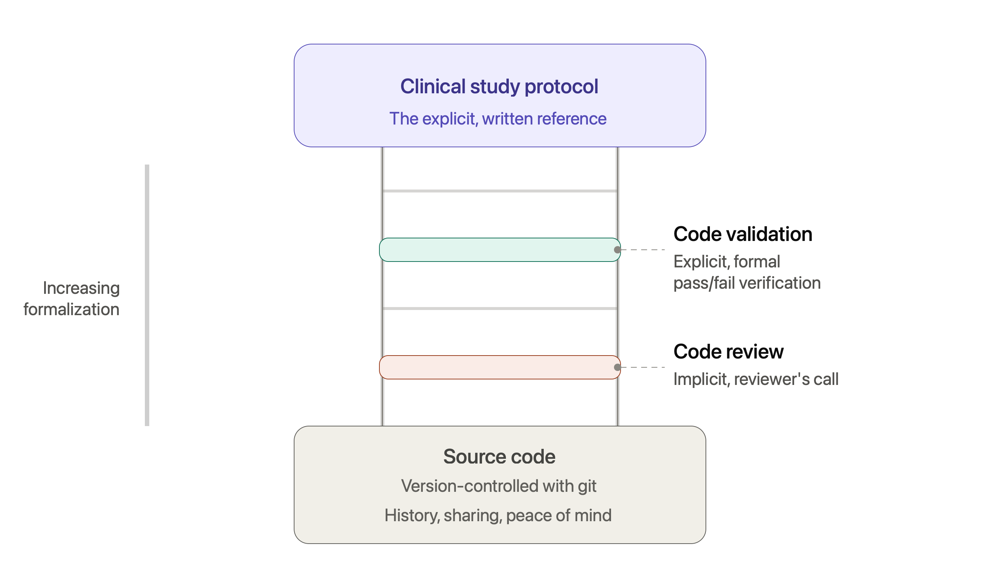
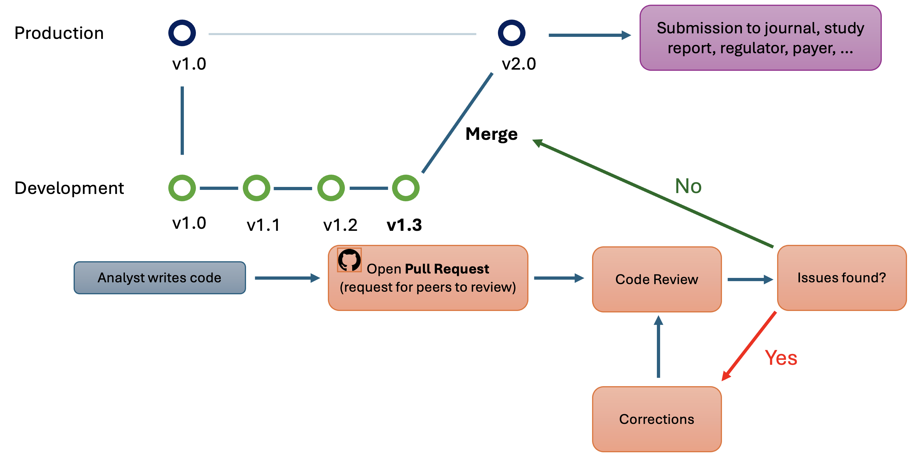
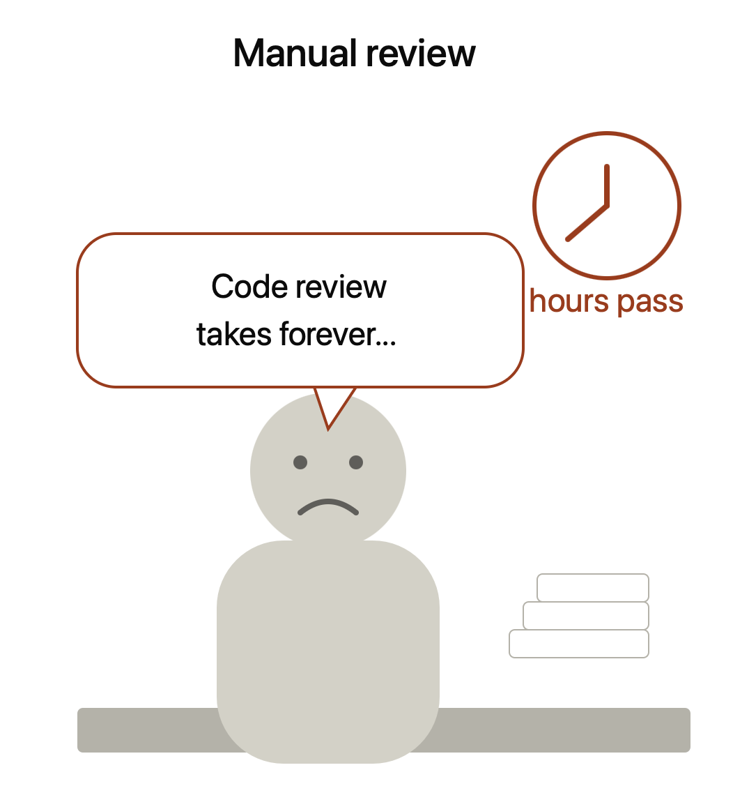
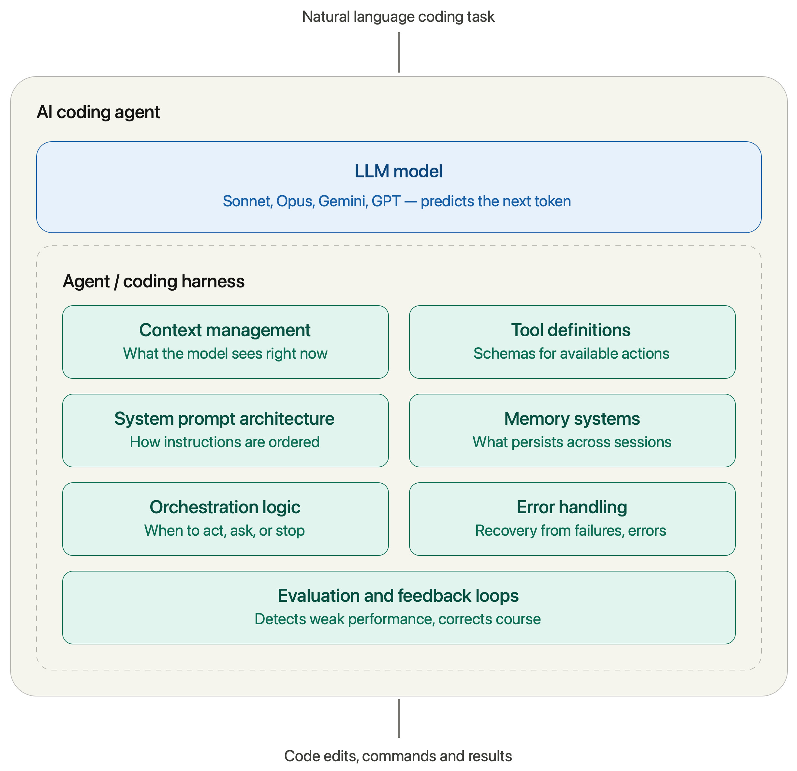
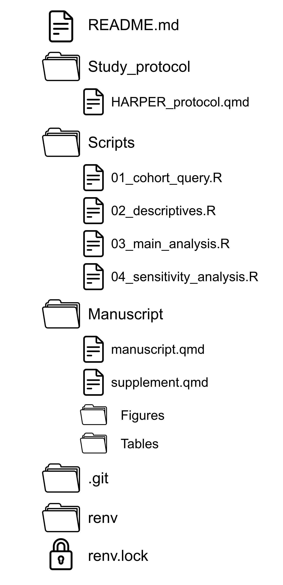
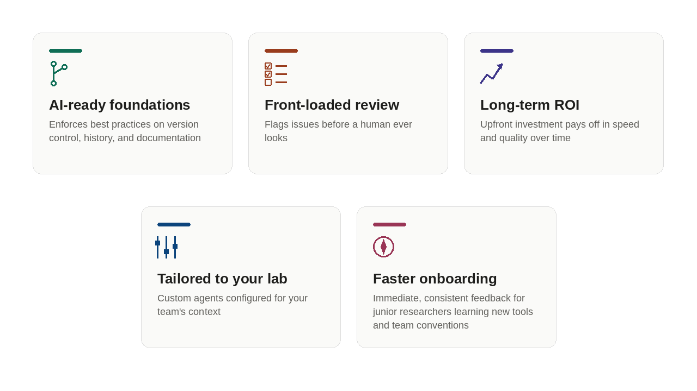
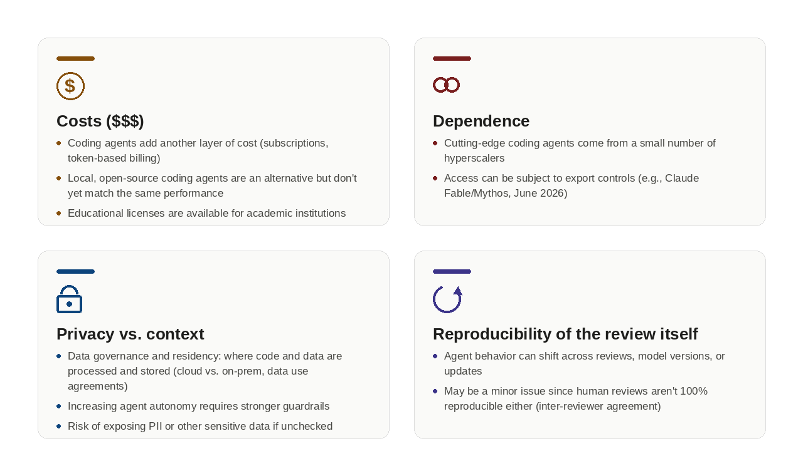

```{r}
#| label: setup
#| include: false

library(tibble)
library(gt)
```

## Disclosures

::: callout-important
## Disclosure
-   JW is an employee of the Enterprise AI organization within AstraZeneca and own shares in AstraZeneca.
<!-- -  The views and opinions expressed in this presentation are those of the author and do not necessarily reflect the official policy or position of AstraZeneca. The author is presenting in a personal capacity. -->
-   JW does not have any financial or personal relationships with Anthropic, Microsoft, or OpenAI, that could influence the content of this presentation.
- Some content in this presentation was generated using Claude Sonnet 5
:::

## Structure Brainstorming {visibility="hidden"}

-   WHY code review and validation is important in pharmacoepidemiology
    -   Code review and validation (differences)
-   Code review and validation: HOW?
    -   Pull requests: the peer-review for code
    -   Human code review
-   Introduction to agentic coding assistants (e.g., GitHub Copilot, Claude Code)
    -   Local review and validation of code
    -   Slash commands and (custom) skills
    -   Agentic code review as part of a pull request workflow
-   Examples of how to use agentic coding assistants for code review and validation in pharmacoepidemiology
    -   Interacting with code using natural language

# Code Review - The Why?

## The Hallmarks of Transparent and Reproducible Research

::::::::::::::: columns
::::: {.column width="25%"}
:::: fragment
::: {.callout-note icon="false"}
## 📋 Pre-specification

-   Research questions, study design, and analysis plan defined **before** looking at outcomes (stratified by exposure status)
-   Pre-registration and publication of study protocols and analysis plans
:::
::::
:::::

::::: {.column width="25%"}
:::: fragment
::: {.callout-note icon="false"}
## 🔀 Version Control & Code Sharing

-   Track changes made to your code
-   Make it publicly available (GitHub, GitLab, OSF, etc.)
:::
::::
:::::

::::: {.column width="25%"}
:::: fragment
::: {.callout-important icon="false"}
## 🔍 Code Review & Validation

-   [**Systematic examination and independent verification of analytic code**]{style="color: #8B0000;"}
:::
::::
:::::

::::: {.column width="25%"}
:::: fragment
::: {.callout-note icon="false"}
## 📝 Documentation & Reporting

-   Structured, transparent reporting of methods and results
-   Follow reporting guidelines (e.g., RECORD-PE, STROBE, etc.)
:::
::::
:::::
:::::::::::::::

## Code Review - The Why?[@vable2021code]

::::::: columns
::: {.column style="width:50%; font-size: 0.65em;"}
- **Pharmacoepidemiology** is a [quantitative discipline]{style="color: #830051;"} which combines knowledge about data, study design, and statistical methods
- **Core competency**: Implementation of a study (data wrangling, statistical analysis) through analytic programming and reproducible code
- **Limited formal training** in programming, version control, and software development best practices
- **Error Prevention**: [Coding bugs are inevitable]{style="color: #830051;"} and code review acts as a ["safety net"]{style="color: #830051;"}
- **Risk Mitigation**: Encourages the [use of validated modular code]{style="color: #830051;"}, which reduces the volume of new, unverified programming for each study
- **Higher Impact**: Release of high-quality, validated code can [increase the impact of your research]{style="color: #830051;"}, as others can build upon your work and reproduce your results
- **Operational Transparency & Audit Trail**: Document decisions and have a complete [audit trail of all changes]{style="color: #830051;"}, which increases traceability and transparency
:::

::: {.column width="50%"}
![Systematic code review serves as a critical safeguard against human error in data analysis, enhancing research quality and transparency while fostering a collective culture of reproducibility within the scientific community.[@vable2021code]](images/Vable-et-al.-2021.png){#fig-aje-2021 fig-cap-location="bottom" style="font-size: 0.6em;"}
:::
:::::

## Consequences of Poor Code Quality (i)

| Severity | Consequence |
|:------------------------------:|:---------------------------------------|
| 🟡 **Best case** | [Inability to re-run the code *(by peers, collaborators, or your future self)*]{style="color: #DAA520;"} |
| 📊 | [Implemented analytics do not reflect the intended study design and analysis plan]{style="color: #D2691E;"} |
| ⚠️ | [Misspecification errors through incorrect coding of exposures, covariates, or outcomes]{style="color: #CC4400;"} |
| 🔐 | [Security vulnerabilities through hardcoding of credentials, API keys, and secrets]{style="color: #B22222;"} |
| 🔴 **Worst case** | [Invalid results and conclusions, retractions, loss of trust in the scientific community, and potential harm on patients]{style="color: #8B0000;"} |

: {tbl-colwidths="\[15,85\]"}

## Consequences of Poor Code Quality (ii)

{#fig-jama-coding-error fig-alt="Following the publication, we were approached by a senior epidemiologist representing a for-profit large dialysis chain who was unable to reproduce our results. Through a series of exchanges and reviews of our publicly available analytic code, we identified a single line of code that had an error in a merge statement in SAS version 9.4 (SAS Institute Inc) in an early step of our study cohort creation when assigning the profit status of a dialysis facility to the time of the event. In the merge of the overall study cohort with a separate file that denoted wait listing, the column indicating the provider number of the dialysis facility from the wait list file overwrote the provider number of the dialysis facility in the study cohort file. Despite multiple analysts reviewing the code for the study, this particular code did not appear as an error. For analysts who code in other programming languages, such as R or Python, this particular merge procedure is handled differently and is not an error, but in SAS, there is no error or warning when the underlying data set has the same variable name as the new data set in the merge. Unfortunately, this resulted in a misclassification of provider numbers of some of the dialysis facilities and assigned the provider number of the transplant center, rather than the dialysis facility, decreasing the number of observations that could be linked to the dialysis facility–level data."}

## Code Review and Validation

*The Peer Review for Code and Best Practices*

{#fig-review-validation-ladder}

::: {.notes}
Following Best Practices
- Use of version control system (git) to track

What is **Code Review**?

-   Systematic examination of source code by one or more reviewers
-   Aimed at identifying bugs, security vulnerabilities, logic errors, and deviations from the analysis plan
-   Ensures code is readable, maintainable, and well-documented

What is **Code Validation**?

-   Confirmation that implemented code produces correct and intended results
-   Includes unit-testing with known inputs and expected outputs
-   Verifies that analytic code matches the pre-specified study design/protocol
-   Ensures reproducibility across environments and analysts (will my code run and produce the same results on another computer?)
:::

# Code Review - The How?

## Code Review - Pull Request Workflow

{#fig-pr-workflow}

## Code Review - GitHub Demo



## Code Validation and Unit-Testing

- Unit-tests are a powerful tool for automating the validation of code correctness and protocol adherence (e.g., using `testthat` in R)
- Unit-testing can automate validation in any applied analytical study and covered **units** are quantifiable

::::: columns
::: {.column style="width: 50%; font-size: 0.72em;"}
**Structural accuracy** — does the model output make sense?

```
test_that("ATO weights are strictly positive", {
  expect_true(all(W$weights > 0))
})
```

::: {.callout-note icon="false" style="font-size: 0.75em;"}
ATO weights equal `ps` (controls) or `1 − ps` (treated). Since `ps ∈ (0, 1)`, a weight ≤ 0 signals a wrong `estimand` or a degenerate propensity score.
:::
:::

::: {.column style="width: 50%; font-size: 0.72em;"}
**Protocol adherence** — does the code match the pre-specified design?

"*The study window spans from a 365-day washout period before index date (time 0)
through up to 365 days of follow-up.*"

```
test_that("all event times ≤ 365 days (CSP §8.3)", {
  events <- cohort[cohort$status == 1, ]
  expect_true(all(events$time <= 365))
})
```

::: {.callout-warning icon="false" style="font-size: 0.75em;"}
A failure means the censoring logic no longer matches the follow-up window defined in the CSP — catching a silent protocol deviation.
:::
:::
:::::

## Manual Code Review Is Time-Consuming

{#fig-code-review-cartoon fig-align="center"}

## Coding Agents[@raschka2026components; @mindstudio2026harness]

{#fig-coding-agents width="95%"}

## Context: Repository Structure as Agent Memory

::::::: columns
::::: {.column width="50%"}
::: {.callout-tip icon="false" style="font-size: 0.7em;"}
## 🤖 Coding Agents Are Context Hungry

The richer the context, the more targeted and accurate the agentic code review
:::

::: {style="font-size: 0.7em;"}
-   📄 **Protocol & analysis plan** — defines the *intended* study design the code should implement
-   💻 **Analysis scripts** — the code to be reviewed, in logical order
-   📦 **Dependencies & environment** — ensures the agent understands the software stack
-   📚 **References & documentation** — provides scientific and methodological context
-   🗂️ **Data dictionaries** — clarifies variable names, codings, and units
-   🔌 **External Information** — additional external context such as software packages used or common data model concepts (e.g., via MCP servers)
:::
:::::

::: {.column width="50%"}
{#fig-repo-structure width="100%" style="max-height: 500px; object-fit: contain;"}
:::
:::::::

## Claude Code - an overview

::::::: columns
::: {.column style="width:50%; font-size: 0.8em;"}
- Agentic coding tool that reads your codebase, edits files, runs commands, and integrates with your development tools
- Available in in terminal (command line), IDE, desktop app, and browser
- Supports structural (native) and contextual (customizable) [**slash commands**]{style="color: #830051;"} [**skills**]{style="color: #830051;"}, including [code review workflows]{style="color: #830051;"}
- Context customizable to a specific user (`~/.claude`), project, and task (`~/project/.claude`) using a dedicated `.claude` directory in the repository
- [Generic Code Review plugin](https://github.com/anthropics/claude-code/blob/main/plugins/code-review/README.md) that can be invoked via `/code-review` slash command
- No free version, subscription-based or token-based pricing
:::

::: {.column width="50%"}
](images/claude-directory.png){#fig-claude-directory width="100%"}
:::
:::::

## Anatomy of `/code-reviewer` agent {.scrollable}

::: {style="font-size: 0.62em; white-space: pre-wrap;"}
``` markdown
---
name: code-reviewer
description: Reviews code changes for bugs, security issues, performance problems, and style.
tools: Read, Grep, Glob, Bash
model: sonnet
---

You are a senior code reviewer with deep expertise in code quality, security, and software design applied to pharmacoepidemiological studies.

When invoked:

## Determine Scope
- [ ] If the user specified a file, commit, branch, or PR, focus there.
- [ ] If no scope is given, run `git diff HEAD` to review uncommitted/staged changes. If that's empty, fall back to `git diff HEAD~1` (the most recent commit).

## Understand Context
- [ ] Read the changed files in full (not just the diff) to understand the surrounding context naming conventions, existing patterns, related tests.

## Review Checklist

Review for:

### Correctness
- [ ] Any logic errors
- [ ] Edge cases
- [ ] Null handling

### Security Review
- [ ] No hardcoded secrets, paths, access tokens, or credentials
- [ ] Injection
- [ ] Auth bypass
- [ ] Data exposure

### Maintainability
- [ ] Naming conventions
- [ ] Complexity (functions doing too much)
- [ ] Duplication (including .qmd chunk duplicates)
- [ ] Consistency with existing patterns
- [ ] README.md updated

### Validation
- [ ] if @sap.qmd or @csp.qmd is available or the user specified a protocol file, cross-check for consistency with clinical study protocol 
- [ ] if testthat/ is available, run unit tests via testthat

### Code Quality Review
- [ ] Conventional commit messages
- [ ] PR description explains what and why
- [ ] Tests cover new functionality
- [ ] Documentation updated
- [ ] Dependencies are up to date and secure

Every finding must include a brief explanation and a concrete fix. Do not execute code.

## Output format:
- [ ] Group findings by severity: **Critical**, **Warning**, **Suggestion**
- [ ] For each finding: file path, line number(s), a short explanation, and a concrete fix or example
- [ ] End with a one-line verdict, e.g. "Ready to merge" or "Needs changes before merge"

Be specific, cite exact lines, and suggest fixes rather than just naming problems. You are strictly read-only — never edit, write, or modify files. Git and grep commands are permitted.
```
:::

## Claude Code - Demo



## Bonus: Interacting with code using natural language[@abdelaziz2024optimizing]{style="font-size: 0.8em;"}



## PROS of Coding Agents

{#fig-coding-agent-pros fig-align="center"}

## CONS of Coding Agents

{#fig-coding-agent-cons fig-align="center"}

## Famous final words

{#fig-talk width="100%"}

## Acknowledgements

::: callout-note
## Thank You

Many thanks to the following colleagues for their input and feedback on this presentation:

-   **AstraZeneca (Enterprise AI)**: Alex Grigorenko, Leonidas Souliotis, Yannis Darhi, Sam Hillman
-   **Transparency and Reproducibility A-team**: Anton Pottegard, Shirley V. Wang, Dani Prieto-Alhambra, Mina Tadrous
:::

## Materials on Version Control and Code Sharing

::: callout-note
## Key References

-   [ICPE 2025 pre-conference course materials](https://janickweberpals.github.io/icpe-git-2025/)

-   Weberpals J and Wang SV. The FAIRification of research in real-world evidence: A practical introduction to reproducible analytic workflows using Git and R. Pharmacoepidemiol Drug Saf. 2024 Jan;33(1):e5740. [doi: 10.1002/pds.5740.](https://onlinelibrary.wiley.com/doi/10.1002/pds.5740) [@weberpals2024fairification]

-   Tazare J, Wang SV, Gini R, et al. Sharing Is Caring? International Society for Pharmacoepidemiology Review and Recommendations for Sharing Programming Code. Pharmacoepidemiol Drug Saf. 2024 Sep;33(9):e5856. [doi: 10.1002/pds.5856.](https://onlinelibrary.wiley.com/doi/10.1002/pds.5856) [@SharingCaring]

-   Schultze A, Tazare J. The role of programming code sharing in improving the transparency of medical research. BMJ. 2023 Oct 17;383:2402. [doi: 10.1136/bmj.p2402](https://www.bmj.com/content/383/bmj.p2402.long). [@schultze2023role]

-   [Pharmacoepidemiology and Drug Safety Special Issue on Pharmacoepidemiology Research Reproducibility](https://onlinelibrary.wiley.com/doi/toc/10.1002/(ISSN)1099-1557.research-reproducibility)
:::

## References